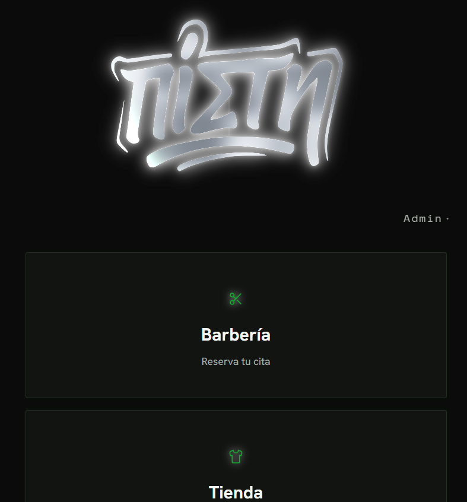
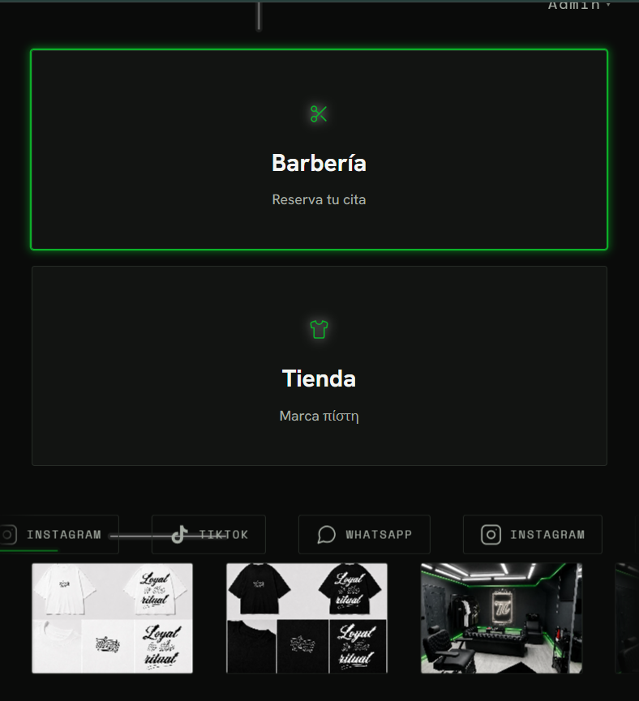
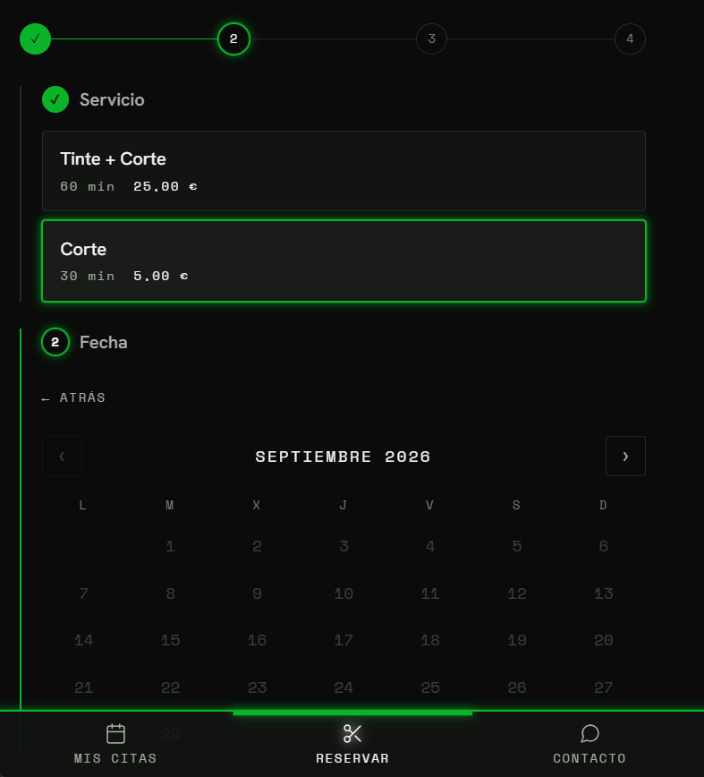
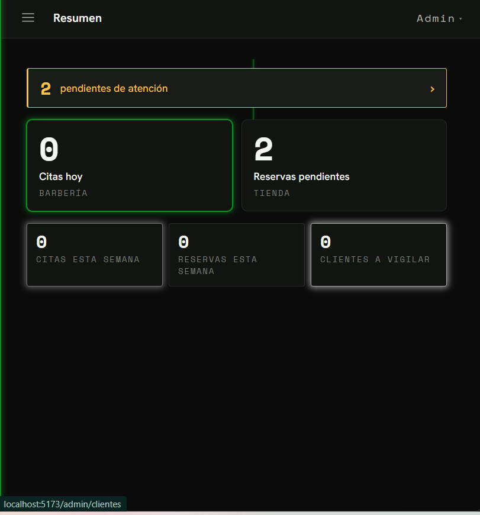
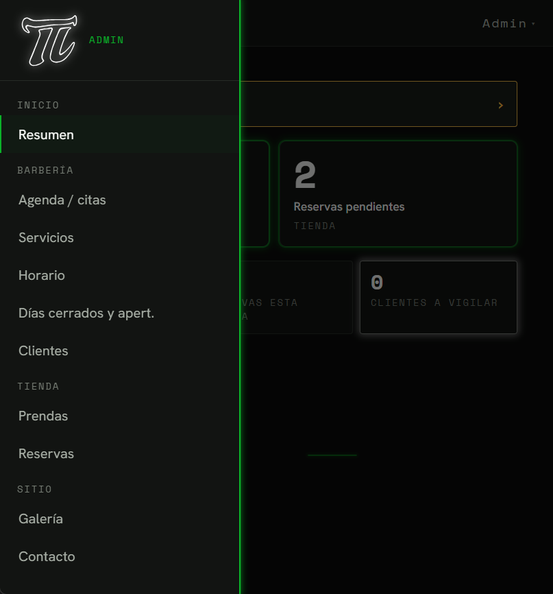
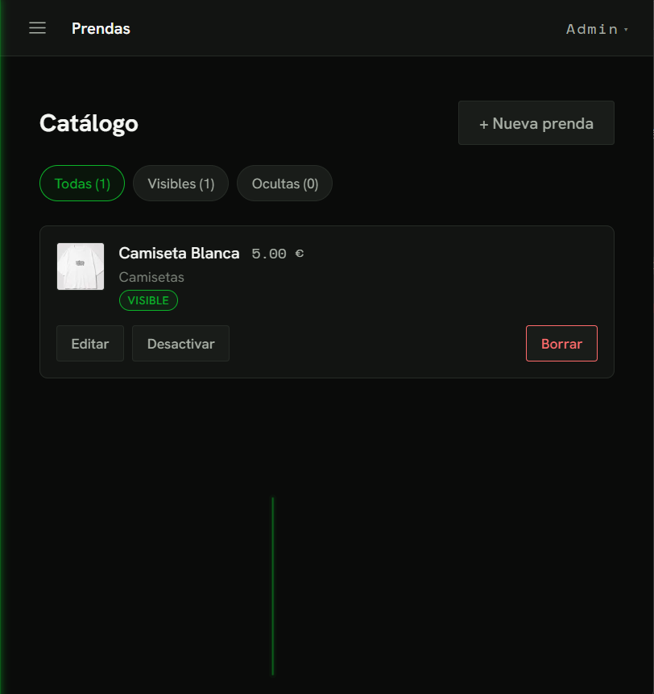

# πίστη — Barbería + Tienda de ropa

> *Loyal to the ritual.*

Aplicación web para **πίστη** (del griego *fe / lealtad*), que reúne en un mismo sitio una **barbería** y una **marca de ropa**. Comparten cuenta de usuario, base de datos y panel de administración.

- **Barbería**: el cliente reserva cita online. Hay franjas de 30 minutos, el backend impide que dos citas se solapen, y se gestionan días cerrados y aperturas excepcionales.
- **Tienda de ropa**, con "reserva sencilla": el cliente ve el catálogo y reserva una **talla**. El dueño recibe un aviso por **Telegram** y cierra la venta en persona. **No hay pago online** y la disponibilidad de cada talla se marca a mano.

Está pensada primero para móvil y es responsive. Solo tiene tema oscuro, con un sistema de luz LED propio como seña de la marca.

---

## 📸 Capturas

<p align="center">
  
  <br>
  <sub><b>Público</b> · portada con el wordmark metálico (WebGL) y las entradas a los dos mundos</sub>
</p>

<table>
  <tr>
    <td align="center" width="50%">
      
      <br><sub><b>Público</b> · hub con las puertas Barbería / Tienda y el banner de redes + galería</sub>
    </td>
    <td align="center" width="50%">
      
      <br><sub><b>Cliente</b> · reservar cita en un solo paso a paso (servicio → fecha → hora)</sub>
    </td>
  </tr>
  <tr>
    <td align="center" width="50%">
      
      <br><sub><b>Admin</b> · resumen con las métricas del negocio</sub>
    </td>
    <td align="center" width="50%">
      
      <br><sub><b>Admin</b> · menú de gestión: barbería, tienda y sitio</sub>
    </td>
  </tr>
  <tr>
    <td align="center" width="50%">
      
      <br><sub><b>Admin</b> · catálogo de prendas con visibilidad y borrado</sub>
    </td>
    <td width="50%"></td>
  </tr>
</table>

---

## Stack

| Capa | Tecnología |
|---|---|
| Backend | FastAPI (Python), SQLAlchemy, Alembic, Pydantic |
| Base de datos | PostgreSQL (en local con Docker; los tests usan SQLite) |
| Autenticación | JWT (`Authorization: Bearer`), contraseñas con bcrypt |
| Seguridad | slowapi (rate limiting), CORS validado en producción, control de acceso por objeto |
| Imágenes | Cloudinary, con subida **firmada** desde el backend |
| Notificaciones | Bot de Telegram (avisos instantáneos y recordatorio diario por cron) |
| Frontend | React 18 + Vite, **JavaScript**, CSS Modules, React Router. Sin Tailwind ni librerías de UI |
| Tests | pytest |
| Hosting | Render (Web Service, PostgreSQL gestionada, Static Site y Cron Jobs) |

---

## Funcionalidades

### Cliente
- **Hub** con dos entradas (Barbería y Tienda) y un banner con dos cintas: una galería de fotos gestionable y las redes sociales.
- **Barbería**: reservar cita en una sola pantalla (servicio → fecha → hora → confirmar), ver "Mis citas" y cancelar las próximas.
- **Tienda**: catálogo por categorías, ficha de prenda con carrusel (admite swipe), reservar talla y ver o cancelar "Mis reservas".
- Registro, login y perfil (editar datos y cambiar contraseña).
- El hub, el catálogo y la galería son públicos. Para reservar y para las pantallas personales hace falta iniciar sesión.

### Panel de administración (`/admin`)
- **Barbería**: agenda diaria (marcar "no asistió" y cancelar), servicios, horario semanal con jornada partida, días cerrados y aperturas excepcionales, y clientes (inasistencias, bloquear y desbloquear).
- **Tienda**: prendas (CRUD, tallas con disponibilidad, hasta 8 imágenes por prenda que se pueden reordenar) y reservas (atender, cancelar, deshacer "atendida").
- **Sitio**: galería del banner (subir, reordenar y borrar).
- **Resumen**: métricas del negocio (citas de hoy y de la semana, reservas pendientes, clientes a vigilar) servidas por `GET /admin/stats`.

---

## Estructura del repositorio

```
.
├── backend/
│   ├── app/
│   │   ├── routers/          # Un router por dominio (barbería / tienda / galería / stats)
│   │   ├── notificaciones/   # Telegram + Cloudinary
│   │   ├── models.py         # Modelos SQLAlchemy
│   │   ├── schemas.py        # Esquemas Pydantic (entrada y salida separados)
│   │   ├── constants.py      # FRANJA_MINUTOS, DURACION_MAX_MINUTOS, DIAS_MAX_RESERVA
│   │   └── main.py
│   ├── alembic/              # Migraciones
│   ├── scripts/              # Crons: recordatorio_diario.py, purga_citas.py
│   ├── tests/                # Suite pytest
│   ├── seed.py               # Crea las cuentas admin si no existen (idempotente)
│   └── requirements.txt
├── frontend/
│   └── src/
│       ├── pages/            # Hub, Barberia, Tienda, Admin, Login, Registro, Perfil, Contacto
│       ├── components/       # Nav, Banner, Logo, CalendarioMes, Carousel, CTAs…
│       ├── motor/            # Motor de luz LED (fondo canvas, efectos)
│       ├── context/          # AuthContext
│       ├── api/              # apiFetch / fetchWithAuth
│       └── theme.css         # Tokens de diseño (fuente de verdad del código)
├── docker-compose.yml        # PostgreSQL local
├── CLAUDE.md                 # Reglas técnicas del proyecto
├── BackendBarberia.md        # Especificación que debe cumplir el backend de citas
├── DESIGN (1).md             # Dirección de diseño (fuente de verdad visual)
├── ESTADO_PROYECTO.md        # Estado y continuidad entre sesiones
└── METODOLOGIA.md            # Forma de trabajo
```

---

## Puesta en marcha en local

### Requisitos
- Python 3.11 o superior
- Node.js 18 o superior
- Docker (para PostgreSQL)

### 1. Base de datos

```bash
docker compose up -d
```

> Si tienes un PostgreSQL nativo escuchando en el puerto 5432, páralo antes, porque entra en conflicto con el contenedor.

### 2. Backend

```bash
cd backend
python -m venv .venv
# Windows: .venv\Scripts\activate   ·   macOS/Linux: source .venv/bin/activate
pip install -r requirements.txt

cp .env.example .env           # y rellena los valores (ver abajo)
alembic upgrade head           # aplica las migraciones
python seed.py                 # crea las cuentas admin
uvicorn app.main:app --reload  # http://localhost:8000  (docs en /docs)
```

### 3. Frontend

```bash
cd frontend
npm install
cp .env.example .env.local     # VITE_API_URL=http://localhost:8000
npm run dev                    # http://localhost:5173
```

### Tests

```bash
cd backend
pytest
```

Los tests corren sobre SQLite y recrean el esquema desde cero, así que **no prueban las migraciones**. Después de añadir una migración, ejecuta también `alembic upgrade head` contra el PostgreSQL local.

---

## Variables de entorno

Los secretos van **solo** en variables de entorno y **nunca** en el repositorio. En los `.env.example` aparecen únicamente los nombres.

**Backend** (`backend/.env`)

| Variable | Descripción |
|---|---|
| `DATABASE_URL` | Cadena de conexión de PostgreSQL |
| `SECRET_KEY` | Clave de firma JWT (`python -c "import secrets; print(secrets.token_hex(32))"`) |
| `ENVIRONMENT` | `development` o `production` |
| `ALLOWED_ORIGINS` | Orígenes CORS (array JSON). En producción falla si quedan orígenes `localhost` |
| `ADMIN1_*`, `ADMIN2_*` | Cuentas admin que crea el seed |
| `TELEGRAM_BOT_TOKEN`, `TELEGRAM_CHAT_ID` | Avisos por Telegram (opcionales; si faltan, los avisos no se envían y no se muestra ningún error) |
| `CLOUDINARY_CLOUD_NAME`, `CLOUDINARY_API_KEY`, `CLOUDINARY_API_SECRET` | Subida firmada de imágenes |

**Frontend** (`frontend/.env.local`)

| Variable | Descripción |
|---|---|
| `VITE_API_URL` | URL base del backend, sin barra final. Vite la incluye al hacer el build, así que tiene que estar definida en ese momento |

---

## Decisiones de diseño relevantes

- **Una reserva de ropa es un aviso de interés, no un bloqueo de stock.** Varios clientes pueden reservar la misma talla y el dueño lo resuelve en persona. No hay campo de stock: la disponibilidad es una marca por talla que el dueño actualiza a mano.
- **No-solape de citas transaccional.** La tabla `FranjaOcupada` tiene `UNIQUE(fecha, hora)` y un conflicto devuelve `409`.
- **Zona horaria Europe/Madrid** en toda la lógica de fechas.
- **Estados de cita derivados**: Reservada, Realizada, Cancelada y No asistió. No existe el estado "Confirmada".
- **Imágenes en Cloudinary** con subida firmada desde el backend: el `api_secret` nunca sale del servidor y el backend fija los formatos y el tamaño máximo en la firma. La base de datos guarda la `url` y el `public_id`.
- **Privacidad (RGPD)**: el teléfono solo lo ve el admin, fuentes servidas desde el propio sitio (sin Google Fonts CDN) y el `cliente_id` se toma siempre del token.

---

## Estado

Backend de barbería y tienda terminado. Frontend terminado en la parte del cliente y en el panel de gestión. Queda pendiente:

- Contenido gestionable de la pantalla de Contacto.
- **Fase 5**: despliegue en Render (pre-deploy con `alembic upgrade head`, crons y dominio).

El detalle está en [`ESTADO_PROYECTO.md`](ESTADO_PROYECTO.md).

---

## Autoría

Desarrollado por **AceitunoDev**. Proyecto privado para cliente; todos los derechos reservados.
